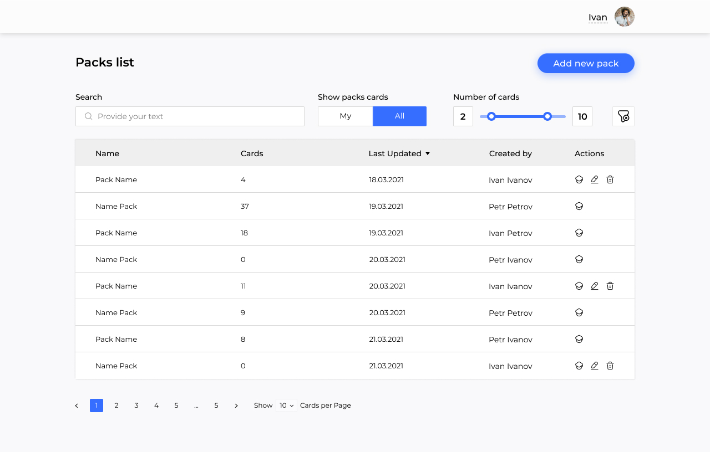

# Learning Cards - an opensource educating project.

## Project description

Learning cards are small note cards used for testing and improving your technical knowledge. Every card is two-sided, with the question on one side and the prompt or full answer on the other.
This may include questions about :
- Vanilla JS,
- React,
- Redux,
- git,
- computer science,
  or about other demanded technologies.

For example, one side of the card may say:
**“What is React”**,
and the other side:
*“A JavaScript library for building user interfaces”*. Usually there are several flashcards that, as a group, represent a category of information you’re trying to remember, learn, and master.

## GitHub commits guideline

**type**: description

**feat** - implemented new functionality from the terms of reference (added zoom support, added a footer, added a product card).
**fix** - bug fixing
**style** - CSS and 
**refactor** - code refactoring
**test** - test added

Commit examples:

test: create unit test for profile reducer

feat: add Header

## Stack:
- React
- Typescript
- redux
- Formik
- MUI
- jest
- IDE- WebStorm